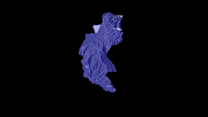

# GEE
## Scripts and developments leveraging the Google Earth Engine API
___
# Google Earth Engine Applications and Developments

Welcome to the repository for Google Earth Engine (GEE) applications and developments. This repository hosts scripts, applications, and projects related to GEE, showcasing various functionalities, analyses, and geospatial developments.

<p align="center">
  
</p>
<p align="center">
  <em>Example screenshot of Glacial Retreat using MODIS/MCD43A4 - Modis (Sierra Nevada de Santa Marta-Col)</em>
</p>

## Overview

This repository contains a collection of scripts and applications developed using the Google Earth Engine platform. These projects cover diverse topics, including (mention specific areas or applications you've worked on).
-   [Earth Engine Homepage](https://earthengine.google.com/)
-   [Web Code Editor](https://code.earthengine.google.com/)
-   [Python
    Installation](https://developers.google.com/earth-engine/python_install)

## Repository Contents

- **Scripts:** Contains standalone scripts demonstrating specific functionalities or analyses.
- **Applications:** Includes web-based applications or interfaces built using GEE.
- **Projects:** Complete project folders, combining various scripts and resources for specific analysis or applications.

## How to Use

Each directory within this repository contains its own README file explaining how to use the scripts or applications. Please refer to the individual directories for more detailed instructions:
```javascript
// Fetching a collection of MODIS NDSI images within a specific date range and limiting the number of images.
var tempCol = ee.ImageCollection('MODIS/MCD43A4_006_NDSI')
  .filterDate('2001-01-01', '2020-12-31')
  .limit(80)
  .select('NDSI');

// Defining visualization parameters for the NDSI values.
var visArgs = { min: -0.1, max: 1, palette: ['000088', '0000FF', '8888FF', 'FFFFFF'] };

// Mapping the visualization over the NDSI collection to generate visualizations.
var tempColVis = tempCol.map(function(img) {
  return img.visualize(visArgs);
});

// Fetching the boundaries for 'Magdalena' in South America.
var southAmCol = ee.FeatureCollection('FAO/GAUL/2015/level2')
  .filter(ee.Filter.eq('ADM1_NAME', 'Magdalena'));

// Defining the area of interest in the Sierra Nevada de Santa Marta region.
var southAmAoi = ee.Geometry.Rectangle([-74.99, 11.71, -73.38, 8.24], null, false);

// Generating a hillshade effect from the SRTM digital elevation model and clipping it to the specified boundary.
var hillshade = ee.Terrain.hillshade(ee.Image('USGS/SRTMGL1_003').multiply(100))
  .clipToCollection(southAmCol);

// Overlaying the temperature visualizations on the hillshade for an animation effect.
var finalVisCol = tempColVis.map(function(img) {
  return hillshade.blend(img.clipToCollection(southAmCol).visualize({ opacity: 0.6 }));
});

// Defining animation parameters and displaying the animation in the console.
var videoArgs = { dimensions: 768, region: southAmAoi, framesPerSecond: 3, crs: 'EPSG:3857', title: 'ID' };
print(ui.Thumbnail(finalVisCol, videoArgs));
print(finalVisCol.getVideoThumbURL(videoArgs));
```
## Contributions

Contributions, suggestions, and feedback are welcome! Feel free to open issues or pull requests for improvements, bug fixes, or new functionalities.

## Contact

For any inquiries or further information, feel free to reach out via [email](mailto:alexanderariza@gmail.com) or [LinkedIn](https://www.linkedin.com/in/alexander-ariza/).

