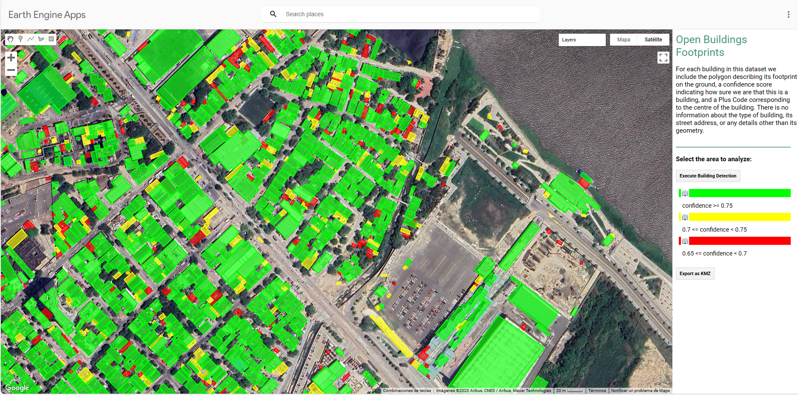

# Open Buildings Footprints

<p align="center">
  
</p>

### Enlace a la APP: [Buildings-Footprint APP](https://ee-aariza.projects.earthengine.app/view/buildings-footprint)

This is a GEE adaptation of the Bing Maps project that is releasing footprints of open buildings around the world. They have detected 777 million buildings from Bing Maps images between 2014 and 2021, including images from Maxar and Airbus. For completeness, data sets from previous versions were included in this data set. You can find the Github repo and more information about the [methodology here](https://github.com/microsoft/GlobalMLBuildingFootprints). Datasets are zipped and available as GeoJSON and GeoJSONL files from different regions. Additional information on preprocessing and some more context is available on the [blog here](https://medium.com/@samapriyaroy/microsoft-building-footprints-in-gee-revisiting-scale-accessibility-eee5e97c17a3)

## Descripción

The current dataset is in its 3rd version (v3). V1 covered Africa, in v2 we expanded to South and South-East Asia and in the current version v3 detections from Latin America and the Caribbean are also included.

For each building in this dataset we include the polygon describing its footprint on the ground, a confidence score indicating how sure we are that this is a building, and a Plus Code corresponding to the centre of the building. There is no information about the type of building, its street address, or any details other than its geometry.

## Funcionalidades Principales

- Funcionalidad 1: Zoom or search to explore, and click on building outlines to see metadata.
- Funcionalidad 2: Confidence level refers to the minimum certainty required to identify a structure as a building in satellite image analysis or spatial data.
- Funcionalidad 3: An app can be updated using Sentinel-2 or other satellite images for improved data accuracy and content enhancement.

## Data preprocessing

The MSBuildings dataset that I have ingested into Google Earth Engine includes earlier releases apart from the 777 Million Global building footprints from Microsoft and in its final state stands at 1 Billion+ footprint (1,069,059,359). There are some interesting performance behaviors across Ingest. 

* While some datasets are released as GeoJSON some are released as Large GeoJSON format (GeoJSONL) and while the zipped sizes are large enough to limit the type of hardware the unzipped extracts are massive vector files. Hence the need to sort and split datasets.
* Ingest times are not necessarily linear across file sizes, seems a complex geometry can take longer to ingest though this is not a consistent enough generalization. 
* Extremely large datasets were split into smaller subsets and ingested. 
* Once the ingestion was completed sub-parts in a folder could be merged, flattened, and exported with varying degrees of success.

## Earth Engine Snippet : Sample

All datasets are in the format

```js
var country  = ee.FeatureCollection('projects/sat-io/open-datasets/MSBuildings/{country_name}');
```

for a list of all countries and assets use this

```js
var ee_folder = ee.data.listAssets("projects/sat-io/open-datasets/MSBuildings");
```

Here are some example setups for two countries

```js
var australia = ee.FeatureCollection('projects/sat-io/open-datasets/MSBuildings/Australia');
var chile = ee.FeatureCollection('projects/sat-io/open-datasets/MSBuildings/Chile')
```

Sample Code: https://code.earthengine.google.com/?scriptPath=users/sat-io/awesome-gee-catalog-examples:population-socioeconomics/GLOBAL-ML-BUILDINGS


#### License

The datasets are released under the [Open Data Commons Open Database License](https://spdx.org/licenses/ODbL-1.0.html).

Created by: Microsoft

Adapted in GEE by: Geoway

Keywords: building footprint, machine learning, remote sensing, global

Last updated in GEE: 2023-12-17

### How did we create the data?
The building extraction is done in two stages:
1.	Semantic Segmentation – Recognizing building pixels on an aerial image using deep neural networks (DNNs)
2.	Polygonization – Converting building pixel detections into polygons

#### Stage1: Semantic Segmentation


#### Stage 2: Polygonization


### How do we estimate building height?
We trained a neural network to estimate height above ground using imagery paired with height measurements, and then we take the 
average height within a building polygon. Structures without height estimates are populated with a -1. Height estimates are in meters. 

### Building confidence scores
Confidence scores are between 0 and 1 and can be read as percent confidence. For structures released before this update, we use -1 as a placeholder value. 
A confidence value of 0.8 is read as "80% confidence." Higher values mean higher detection confidence. There are two stages in the building detection process -- first we use a model to classify pixels as either building or not and next we convert groups of pixels into polygons. Each pixel has a probability of being a building and a 
probability >0.5 is classified as "building pixel". When we generate the polygons, we then look at the pixels within and average the probability values to give and 
overall confidence score. The confidence scores are for the footprint and not height estimate. 

### Were there any modeling improvements used for this release? 
We did not apply any modeling improvements for this release. Instead, we focused on scaling our approach to increase coverage, and trained models regionally.  

### Evaluation set metrics
The evaluation metrics are computed on a set of building polygon labels for each region. Note, we only have verification results for 
Mexico buildings since we did not train a model for the country. 

Building match metrics on the evaluation set:

| Region          | Precision   | Recall   |
|:----------------:|:------------:|:---------:|
| Africa          | 94.4%       | 70.9%    |
| Caribbean      | 92.2%       | 76.8%    |
| Central Asia    | 97.17%      | 79.47%   |
| Europe          | 94.3%       | 85.9%    |
| Middle East     | 95.7%       | 85.4%    |
| South America   | 95.4%       | 78.0%    |
| South Asia      | 94.8%       | 76.7%    |


We track the following metrics to measure the quality of matched building polygons in the evaluation set:
1. Intersection over Union – This is a standard metric measuring the overlap quality against the labels
2. Dominant angle rotation error – This measures the polygon rotation deviation

| Region          | IoU    |   Rotation error [deg] |
|:----------------:|:-------:|:-----------------------:|
| Africa          | 64.5%  |                   5.67 |
| Caribbean      | 64.0%  |                   6.64 |
| Central Asia    | 68.2%  |                   6.91 |
| Europe          | 65.1%  |                  10.28 |
| Middle East     | 65.1%  |                   9.3  |
| South America   | 66.7%  |                   6.34 |
| South Asia      | 63.1%  |                   6.25 |


### False positive ratio in the corpus

False positives are estimated per country from randomly sampled building polygon predictions.

| Region | Buildings Sampled | False Positive Rate | Run Date |
| :--: | :--: | :--: | :--: |
| Africa | 5,000 | 1.1% | Early 2022 | 
| Caribbean | 3,000 | 1.8% | Early 2022 |
| Central Asia | 3,000 | 2.2% | Early 2022 |
| Europe | 5,000 | 1.4% | Early 2022 |
| Mexico | 2,000 | 0.1% | Early 2022 |
| Middle East | 7,000 | 1.8% | Early 2022 |
| South America | 5,000 | 1.7% | Early 2022 |
| South Asia | 7,000 | 1.4% | Early 2022 | 
| North America  | 4,000 | 1% | Oct 2022 |
| Europe Maxar | 5,000 | 1.4% | July 2022 |


### What is the vintage of this data?
Vintage of extracted building footprints depends on the vintage of the underlying imagery. The underlying imagery is from Bing Maps including Maxar and Airbus between 2014 and 2021.

### How good is the data?
Our metrics show that in the vast majority of cases the quality is at least as good as hand digitized buildings in OpenStreetMap. It is not perfect, particularly in dense urban areas but it provides good recall in rural areas.

### What is the coordinate reference system?
EPSG: 4326

### Will there be more data coming for other geographies?
Maybe. This is a work in progress. Also, check out our other building releases!
* [US](https://github.com/microsoft/USBuildingFootprints)
* [Australia](https://github.com/microsoft/AustraliaBuildingFootprints)
* [Canada](https://github.com/microsoft/CanadianBuildingFootprints)
* [Uganda and Tanzania](https://github.com/microsoft/Uganda-Tanzania-Building-Footprints)
* [South America](https://github.com/microsoft/SouthAmericaBuildingFootprints)
* [Kenya and Nigeria](https://github.com/microsoft/KenyaNigeriaBuildingFootprints)
* [Indonesia, Malaysia, and the Philippines](https://github.com/microsoft/IdMyPhBuildingFootprints)

### Why are some locations missing?
We excluded imagery from processing if tiles were dated before 2014 or there was a low-probability of detection. Detection probability is loosely defined here as proximity to roads and population centers. This filtering and tile exclusion results in squares of missing data. 

### How can I read large files?
Some files are very large but they are stored in line-delimited format so one could use parallel processing tools (e.g., [Spark](https://spark.apache.org/), [Dask](https://docs.dask.org/en/stable/dataframe.html)) or create a memory 
efficient script to segment into smaller pieces. See `scripts/read-large-files.py` for a Python example. 

## Need roads?
Check out our [ML Road Detections](https://github.com/microsoft/RoadDetections) project page!

<br>

## Contributing

This project welcomes contributions and suggestions.  Most contributions require you to agree to a
Contributor License Agreement (CLA) declaring that you have the right to, and actually do, grant us
the rights to use your contribution. For details, visit https://cla.microsoft.com.

When you submit a pull request, a CLA-bot will automatically determine whether you need to provide
a CLA and decorate the PR appropriately (e.g., label, comment). Simply follow the instructions
provided by the bot. You will only need to do this once across all repos using our CLA.

This project has adopted the [Microsoft Open Source Code of Conduct](https://opensource.microsoft.com/codeofconduct/).
For more information see the [Code of Conduct FAQ](https://opensource.microsoft.com/codeofconduct/faq/) or
contact [opencode@microsoft.com](mailto:opencode@microsoft.com) with any additional questions or comments.

## Legal Notices

Microsoft, Windows, Microsoft Azure and/or other Microsoft products and services referenced in the documentation
may be either trademarks or registered trademarks of Microsoft in the United States and/or other countries.
The licenses for this project do not grant you rights to use any Microsoft names, logos, or trademarks.
Microsoft's general trademark guidelines can be found [here](http://go.microsoft.com/fwlink/?LinkID=254653).

Privacy information can be found [here](https://privacy.microsoft.com/en-us/).

Microsoft and any contributors reserve all others rights, whether under their respective copyrights, patents,
or trademarks, whether by implication, estoppel or otherwise.


