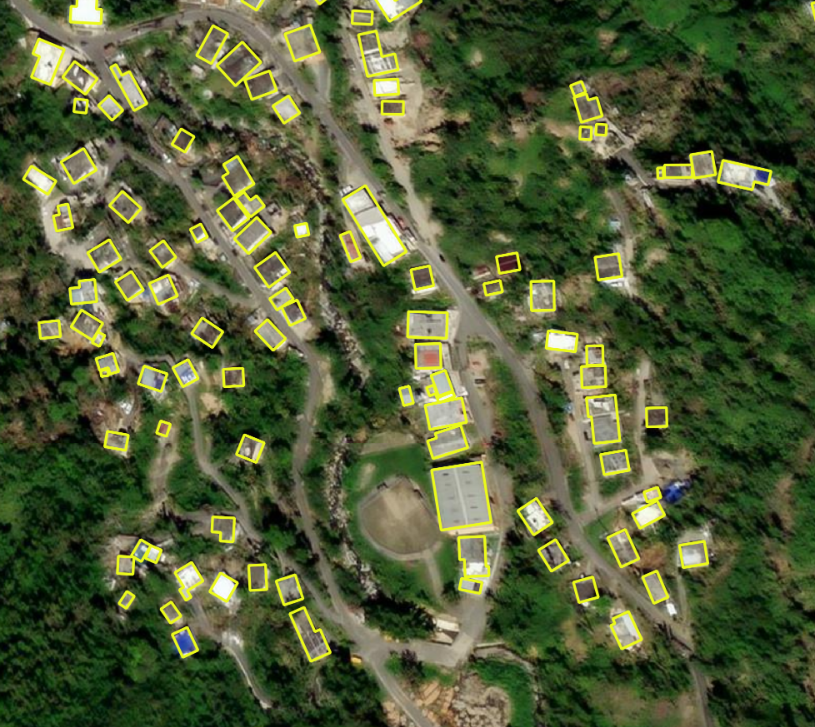

# Análisis Geoespacial para Planificación Urbana y Rural con Google Earth Engine

Este repositorio almacena scripts y recursos utilizados en proyectos de evaluación del crecimiento urbano, seguimiento de cambios en infraestructura, y planificación del uso del suelo utilizando Google Earth Engine.

  

## Descripción del Proyecto

El enfoque del proyecto es analizar y comprender el crecimiento urbano, cambios en la infraestructura y planificación del uso del suelo para apoyar la toma de decisiones en desarrollo urbano y rural sostenible.

## Contenido

- **Scripts:** Scripts de GEE para análisis de imágenes satelitales, identificación de patrones urbanos, y evaluación de cambios en infraestructura.
- **Recursos:** Datos auxiliares como shapefiles, imágenes de clasificación de suelo, entre otros.

## Ejecución

Los scripts están adaptados para ser ejecutados en la plataforma Google Earth Engine y cuentan con documentación para su fácil utilización.

## Fuentes de Datos

Se emplean imágenes satelitales de alta resolución, conjuntos de datos urbanos y mapas de uso del suelo disponibles en GEE.

## Contribuciones

Se aceptan contribuciones para mejorar y expandir este proyecto. Informes de problemas (issues) y solicitudes de extracción (pull requests) son bienvenidos.

## Contacto

Para consultas y colaboraciones, contáctanos [aquí](mailto:tu_correo@example.com).

¡Gracias por tu interés en este proyecto de planificación urbana y rural!
